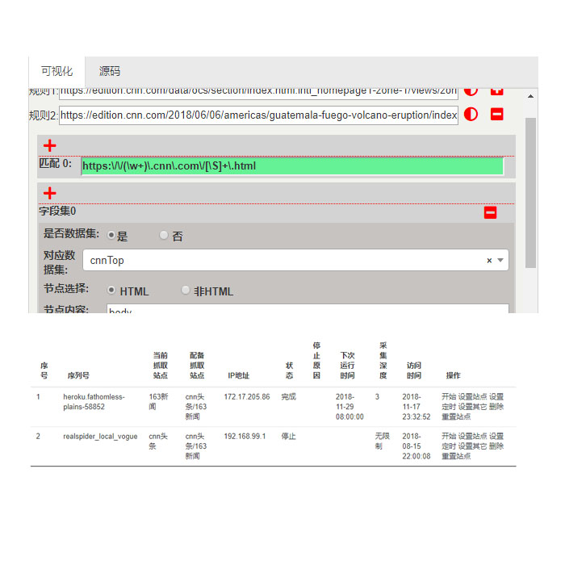

GoldDataSpider
===============
介绍
------

金色数据采集器开源项目，是用于抓取网页和抽取数据的工具。其核心代码是从金色数数据平台分离而来。


该项目提供抓取和抽取来自网页数据，不仅可以抽取网页内的内容，还能抽取URL、HTTP报头、Cookie里的数据。

该项目定义了一种简洁、灵活、敏捷的结构或者说是规则语法。极尽其所能将网页内容、HTTP报头、Cookie、甚至关联其它网页、其它网站数据，抽取出有意义有价值数据字段，组成一条数据记录。除此之外，还能内嵌http请求，以补充数据字段，比如某些字段需要向词典提供翻译这样的字段等等。

该项目还可支持从各种类型文档抽取数据，比如html/xml/json/javascript/text等。


使用入门
---------------
首先，我们需要将依赖加入项目当中，如下：

1、对于maven项目
```xml
<dependency>
  <groupId>com.100shouhou.golddata</groupId>
  <artifactId>golddata-spider</artifactId>
  <version>1.1.3</version>
</dependency>
```
2、对于gradle项目
```groovy
 compile group: 'com.100shouhou.golddata', name: 'golddata-spider', version: '1.1.3'
```
 
然后你将可以使用该依赖所提供的简洁清晰的API，如下:
```java
@Test
public void testGoldSpider(){
    String ruleContent=
            "    {                                                      \n"+
            "      __node: li.sky.skyid                                 \n"+
            "      date:                                                \n"+
            "      {                                                    \n"+
            "        expr: h1                                           \n"+
            "        __label: 日期                                      \n"+
            "      }                                                    \n"+
            "      sn:                                                  \n"+
            "      {                                                    \n"+
            "                                                           \n"+
            "        js: md5(baseUri+item.date+headers['Content-Type']);\n"+
            "      }                                                    \n"+
            "      weather:                                             \n"+
            "      {                                                    \n"+
            "        expr: p.wea                                        \n"+
            "      }                                                    \n"+
            "      temprature:                                          \n"+
            "      {                                                    \n"+
            "        expr: p.tem>i                                      \n"+
            "      }                                                    \n"+
            "    }                                                      \n";
    GoldSpider spider= com.xst.golddata.GoldSpider.newSpider()
            .setUrl("http://www.weather.com.cn/weather/101020100.shtml")
            .setRule(ruleContent)
            .request();
    List list=spider.extractList();
    // List<Weather> weathers=spider.extractList(Weather.class);
    // Weather weathers=spider.extractFirst(Weather.class);
   list.forEach( System.out::println);
}
```

运行上面的测试，你将可以看类似下面的输出：
```bash
{date=19日（今天）, weather=阴转小雨, temprature=10℃, sn=8bc265cb2bf23b6764b75144b255d81d}
{date=20日（明天）, weather=小雨转多云, temprature=11℃, sn=9efd7e7bbbfb9bb06e04c0c990568bfd}
{date=21日（后天）, weather=多云转中雨, temprature=11℃, sn=728539ac882721187741708860324afa}
{date=22日（周六）, weather=小雨, temprature=9℃, sn=a23fa2233e750a3bdd11b2e200ed06c3}
{date=23日（周日）, weather=小雨转多云, temprature=8℃, sn=b27e1b8a8e92a7bed384ceb3e4fdfb5f}
{date=24日（周一）, weather=多云转小雨, temprature=8℃, sn=c142b7fd12330ca031dd96b307c0d50d}
{date=25日（周二）, weather=小雨转中雨, temprature=6℃, sn=16f71d3c8f09394588532a3ed1a8bacf}
```
当作Service或者API使用
----
你可以在项目中，可以当作调用服务和API使用。例如如下：
```java
@Service
public class WeatherServiceImpl implements WeatherService{

	public List<Weather> listByCityId(Long cityId){
		String url="http://www.weather.com.cn/weather/"+cityId+".shtml"
	    String rule="<同上>"
		GoldSpider spider= com.xst.golddata.GoldSpider.newSpider()
						.setUrl(url)
						.setRule(ruleContent)
						.request();
            
        return spider.extractList(Weather.class);    
	}
}
```
另外，你可以免费使用可视化编辑器来编辑规则内容， 可视化编辑器来自金色数据平台，可以点击<a href="https://golddata.100shouhou.com/front/download" target="_blank">链接</a>下载，可视化编辑器截屏如下：



文档和培训视频
-------------
规则内容以及文档请点击<a href="https://golddata.100shouhou.com/front/docs" target="_blank">此处</a>查看


许可证
--------
Golddata-Spider 采用[Apache License, Version 2.0](http://www.apache.org/licenses/LICENSE-2.0.html) 协议。
